# Acceso remoto con PUTTY y RDP

---

## Parte 1: Putty

Usuario autorizado: remoto_ssh  
Cliente: PuTTY 
Autenticación: clave pública  
Contraseña por SSH: deshabilitada  
Usuarios no autorizados: acceso denegado

---

Comprobar que el servicio SSH está instalado y activo en Ubuntu Server:

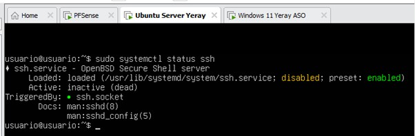

Crear un usuario dedicado únicamente al acceso remoto por SSH, remoto_ssh:

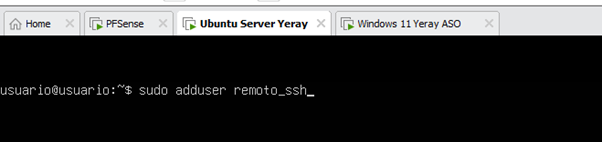

Generar un par de claves en Windows 11:

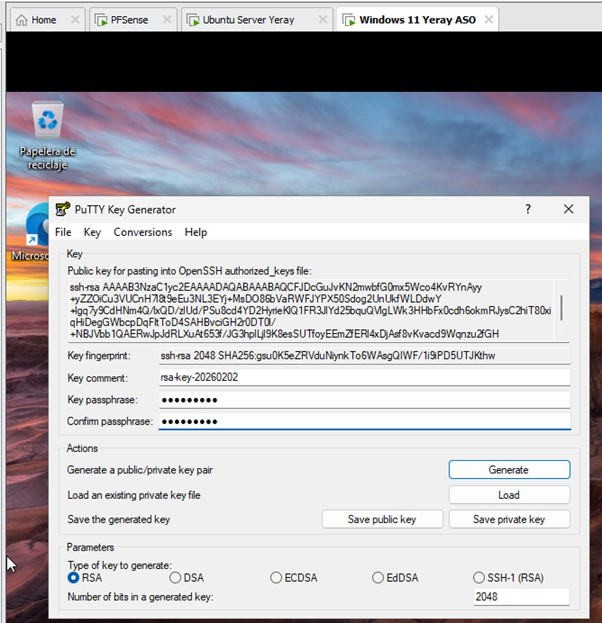

Copiar la clave pública al servidor Ubuntu:

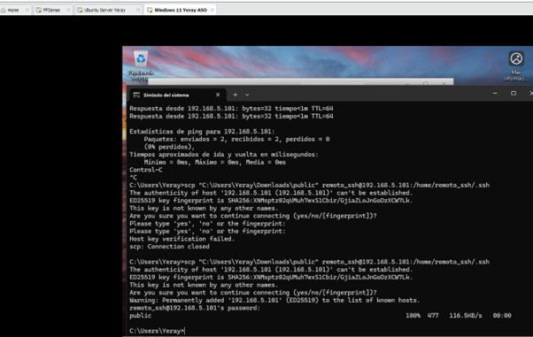

Configurar el usuario remoto_ssh para que el servidor reconozca la clave pública:

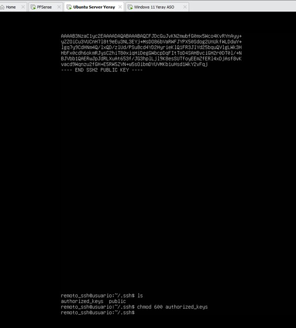

Antes de aplicar medidas adicionales de seguridad, comprobar el acceso por ssh usando el usuario remoto_ssh mediante clave pública. Verificar que el acceso funciona correctamente:

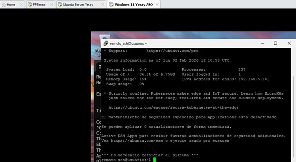

Una vez verificado que el acceso por clave funciona, deshabilitar la autenticación por contraseña en el servicio SSH:

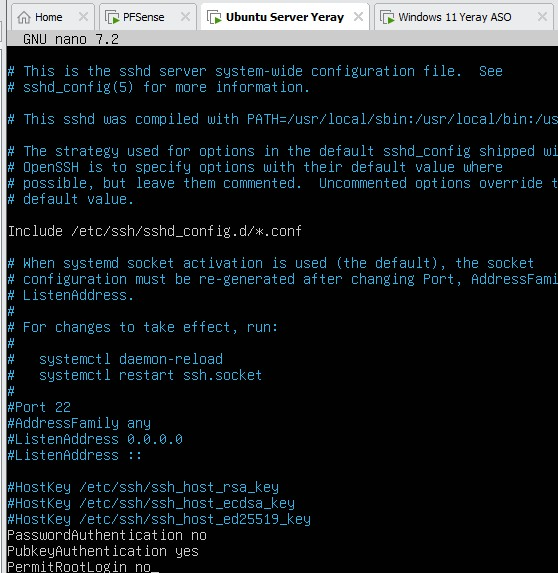
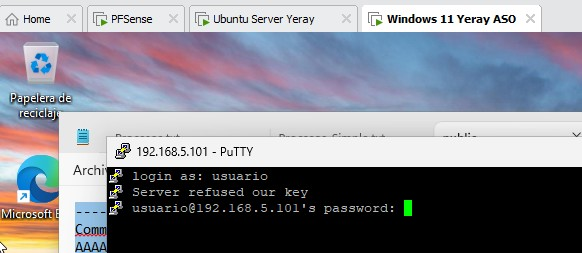

---

## Parte 2: RDP

Usuario RDP: remoto_rdp  
Sistema administrado: Windows Server 2025 
Protocolo: RDP  
Grupo de acceso: Usuarios de Escritorio remoto  
Cifrado: Sí  

---

En Windows Server, habilitar el escritorio remoto para permitir conexiones remotas a la máquina:

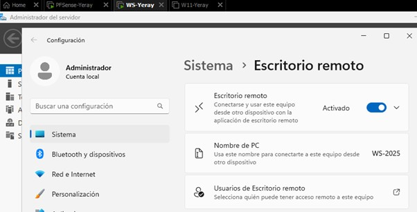

Crear un usuario exclusivo remoto_rdp para acceso por escritorio remoto y añadirlo al grupo Usuarios de Escritorio remoto: 

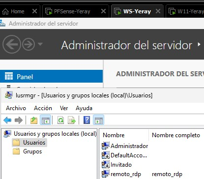
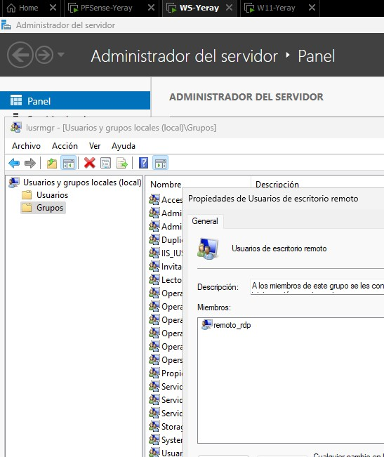

Desde el equipo Windows 11, acceder al Windows Server mediante escritorio remoto usando únicamente el usuario dedicado creado, remoto_rdp:

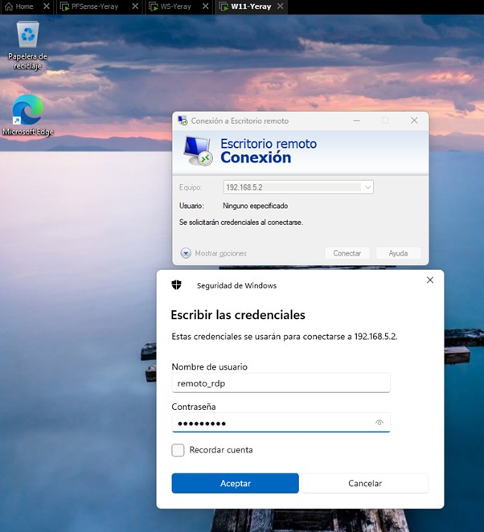
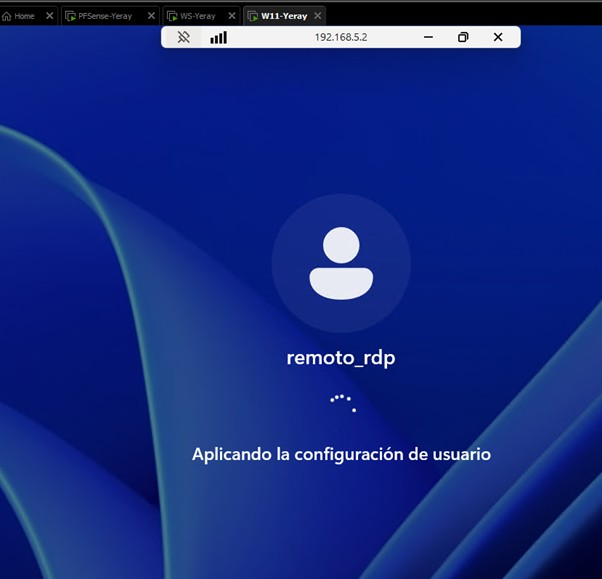

Comprobar que otro usuario distinto de remoto_rdp NO puede acceder por RDP:

