# Tarea de Automatización con GPOs
---

## Parte 1: Mapeo automático de unidades de red:

**Objetivo:** Configurar la asignación automática de recursos de red mediante GPO según el grupo de seguridad del usuario.

### Configuración de Permisos
Para garantizar la seguridad, se han configurado permisos NTFS y de red eliminando el grupo "Todos" en las carpetas departamentales.

| Recurso Compartido | Ruta Local | Acceso Autorizado | Justificación |
| :--- | :--- | :--- | :--- |
| **Compartida-Admin** | `C:\Compartidas\Admin` | `GRP_Administracion` | Restringido solo a personal de administración. |
| **Compartida-Info** | `C:\Compartidas\Informatica` | `GRP_Informatica` | Restringido solo a personal de informática. |
| **Compartida-Todos** | `C:\Compartidas\Comun` | `Todos los usuarios` | Recurso común para intercambio de archivos. |

### Implementación de la GPO
* **Nombre:** `Mapeo-Unidades-YGM`.
* **Ubicación:** Configuración de usuario > Preferencias > Asignaciones de unidad.
* **Segmentación:** Se utiliza para que cada grupo vea solo su unidad correspondiente (Z: o Y:), además de la unidad común (X:).
* **Vinculación:** La GPO está vinculada a `UO_Administracion`, `UO_Informatica` y `UO_Usuarios`.

---

# Tarea 1: Mapeo Automático de Unidades de Red

### Estructura de UOs:
Se ha configurado la jerarquía de **Unidades Organizativas** en el **Active Directory** para organizar a los usuarios y equipos según su función.

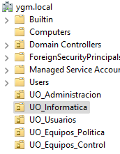

---

### Carpetas a compartir:
Se han creado las carpetas locales en el servidor dentro de la ruta `C:\Compartidas\`.

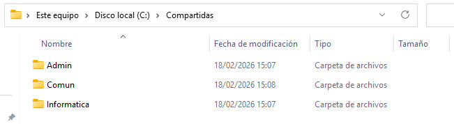

---

### Compartición de carpetas:

#### Carpeta Admin:
Configuración de los **permisos de recurso compartido** y **permisos NTFS** para el grupo **GRP_Administracion**.

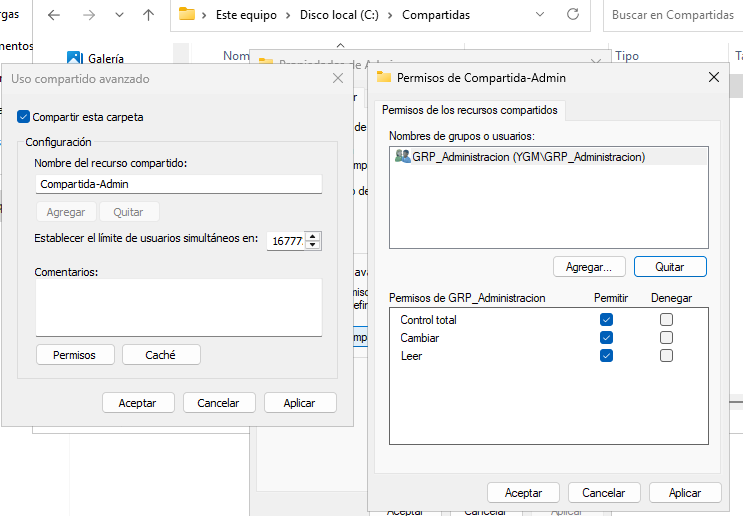
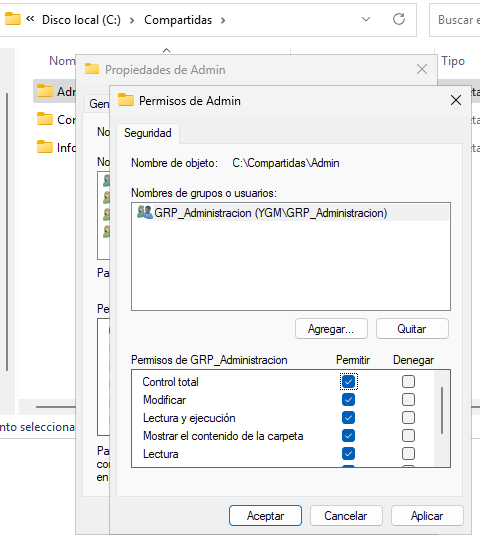

#### Carpeta Informatica:
Configuración de los **permisos de recurso compartido** y **permisos NTFS** para el grupo **GRP_Informatica**.

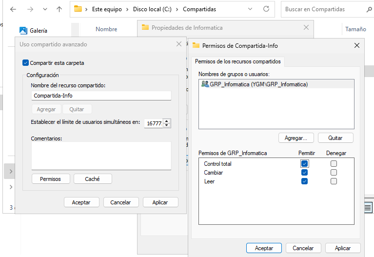
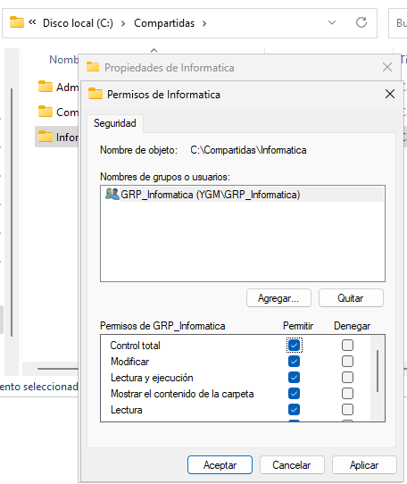

#### Carpeta Comun:
Configuración de los **permisos de recurso compartido** y **permisos NTFS** para el grupo **Todos los usuarios**.

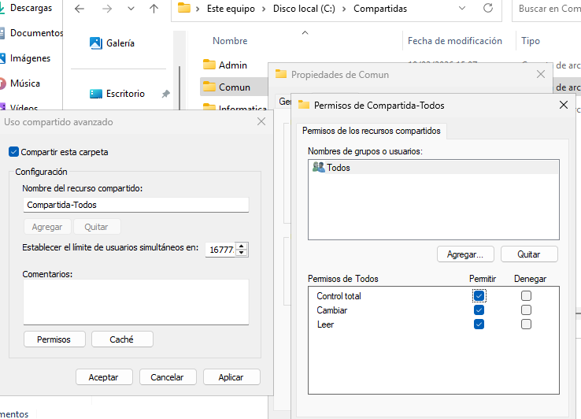
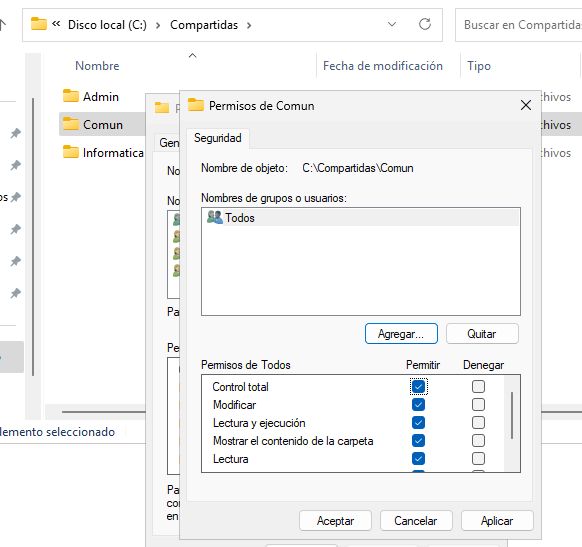

---

### Crear GPO:
Se ha procedido a la creación de la **GPO** denominada **Mapeo-Unidades-[INICIALES]** para gestionar la automatización.

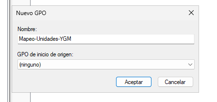

---

### Mapear las unidades de red:
Para cada unidad, se debe marcar la acción como **Crear**, definir la **ruta UNC**, asignar la **letra** correspondiente y marcar la opción de **mostrar**. En la pestaña **Común**, se configura la **Segmentación a nivel de elemento** para asociar cada carpeta a su respectivo grupo de seguridad.

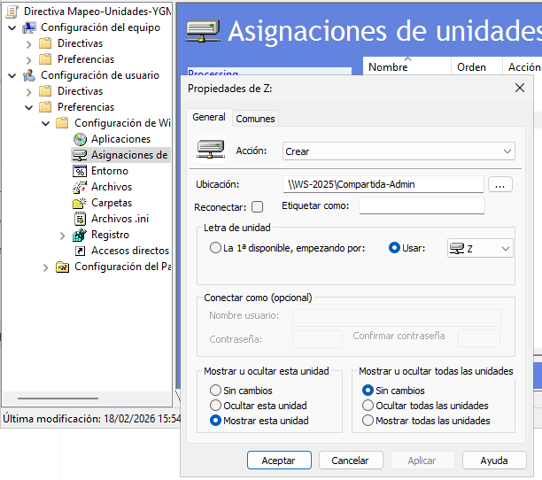
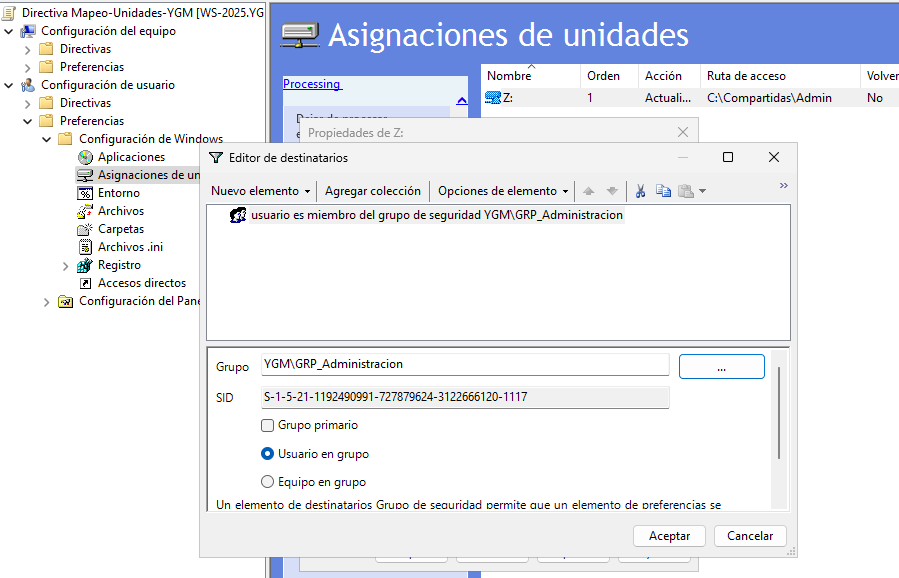
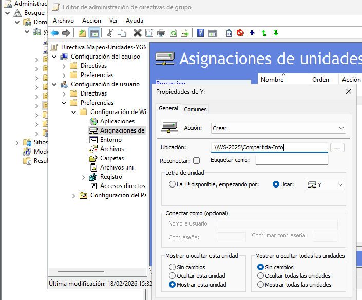
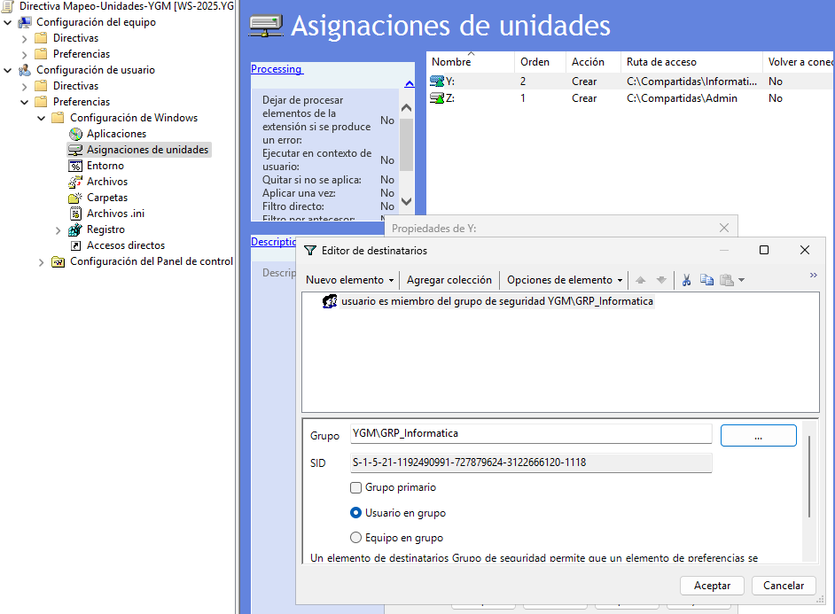
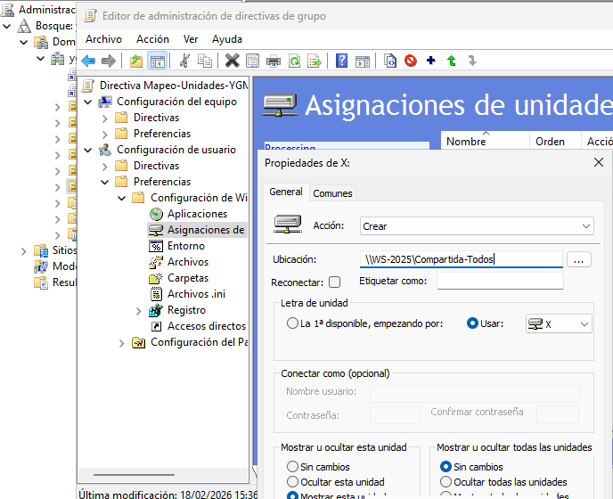
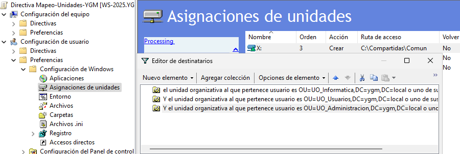

---

### Todas las carpetas mapeadas:
Vista general de la configuración final de las tres unidades (Z:, Y:, X:) dentro de la **GPO**.

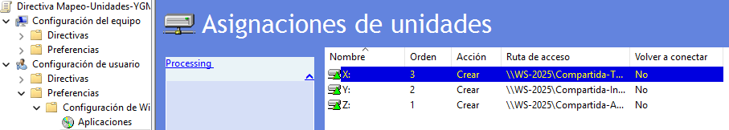

---

### Pruebas de correcto funcionamiento:

#### Con el usuario user_admin1:
El usuario perteneciente a **GRP_Administracion** visualiza correctamente las unidades **Z:** y **X:**.

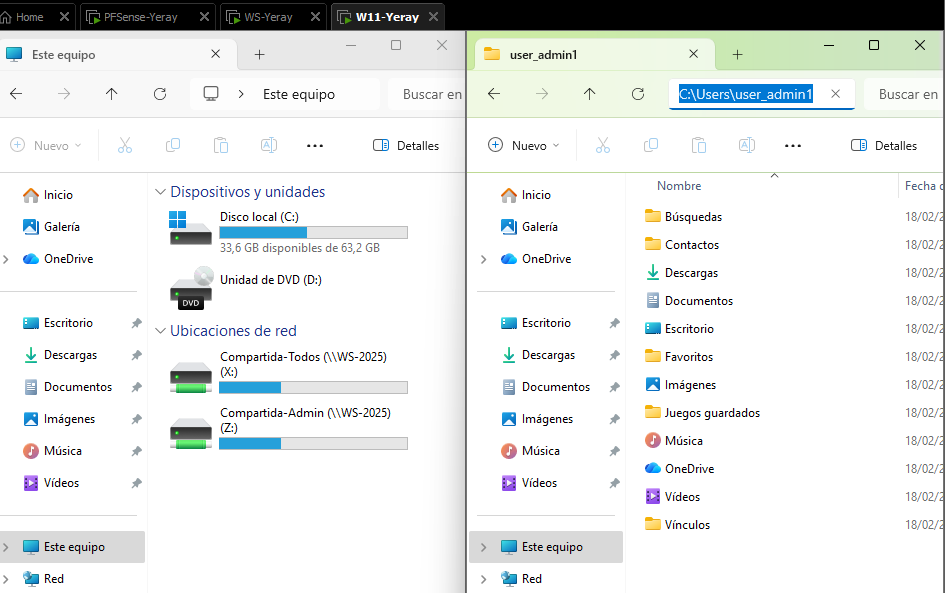

#### Con el usuario user_info1:
El usuario perteneciente a **GRP_Informatica** visualiza las unidades **Y:** y **X:**, y se verifica el **acceso denegado** al intentar entrar en recursos no autorizados.

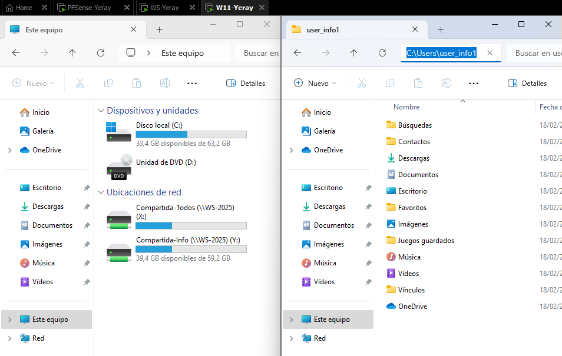
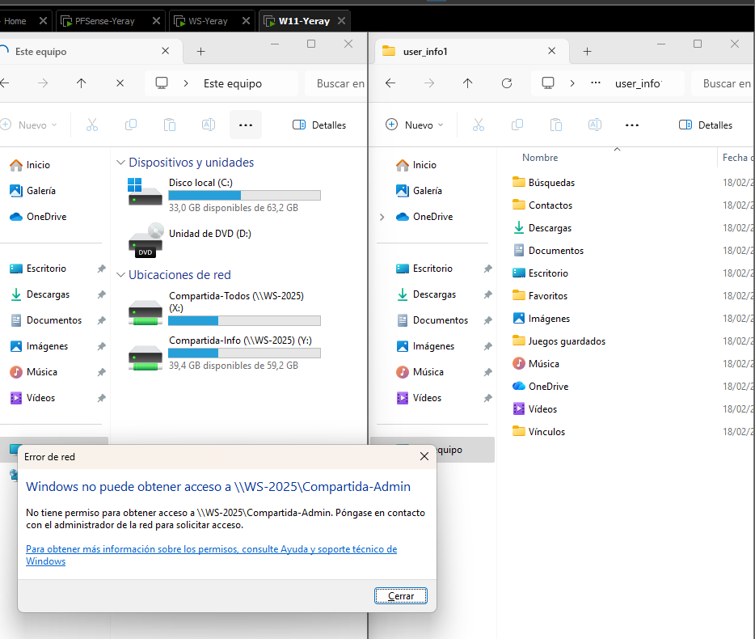

---
## Parte 2: Automatización de ejecución de script de limpieza

**Objetivo:** Crear una GPO que despliegue y programe un script de mantenimiento en los equipos cliente para limpiar archivos temporales sin intervención manual.

### Despliegue del Script
* **Ubicación:** El script se encuentra en la ruta de red `\\YGM.local\SYSVOL\YGM.local\scripts\` para asegurar su disponibilidad en toda la red.
* **GPO:** `Mantenimiento-Automatico-YGM` vinculada a la `UO_Usuarios`.

### Configuración de la Tarea Programada
La automatización se ha configurado bajo "Tareas programadas" con las siguientes características:
* **Ejecución:** Semanal con privilegios elevados.
* **Usuario:** Se ejecuta con la cuenta `SYSTEM` para garantizar que no dependa de un usuario logueado.
* **Acción:** Ejecución de PowerShell apuntando al script en SYSVOL.
* **Registro:** Se genera un log automático en `C:\Logs` para verificar cada ejecución.

---

### Script para la tarea:
Script que voy a usar para la tarea:

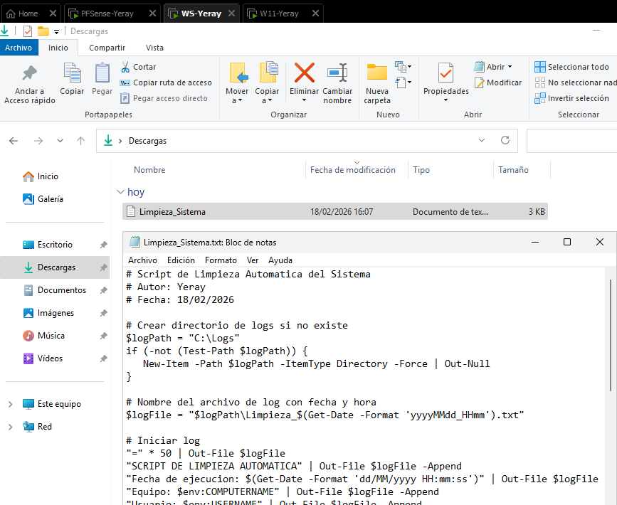

---

### Script en la carpeta SYSVOL:
Guardar el script `\\YGM.local\SYSVOL\YGM.local\scripts\` para asegurar que sea accesible por todos los equipos del dominio.

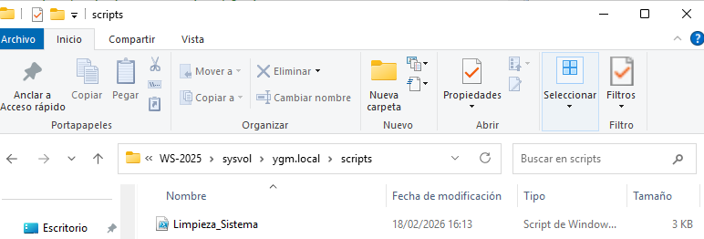

---

### Crear la GPO Mantenimiento-Automatico-YGM:
Crear una nueva **GPO** con el nombre Mantenimiento-Automatico-YGM

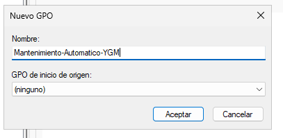

---

### Crear la Tarea Programada:
Dentro de la configuración de la GPO, definir una nueva **Tarea programada (Windows 7 o posterior)** configurada para ejecutarse con la cuenta **SYSTEM** y los privilegios más elevados.

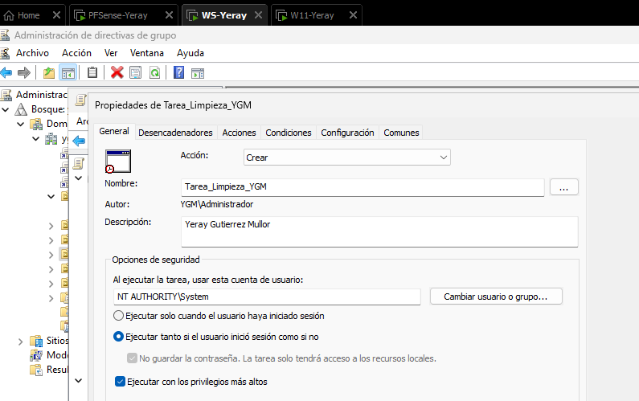

---

### Establecer el desencadenador:
Configurar el **desencadenador** para establecer la frecuencia de ejecución automática de la tarea.

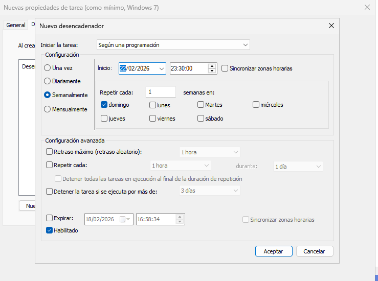

---

### Establecer la acción:
Establecer la **acción** que ejecutará el script, pasando como argumento la ruta del script alojado en el servidor.

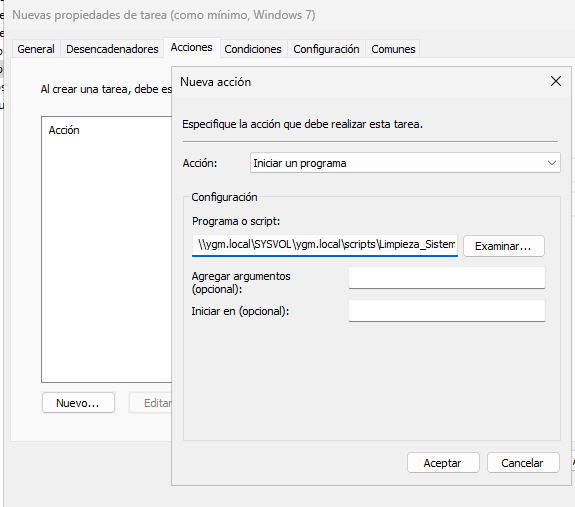

---

### Prueba con el usuario user_user1:
Iniciar sesión en el equipo cliente con el usuario de prueba.

---

### Ejecutar gpupdate /force:
Forzar la actualización de las directivas de grupo mediante el comando **gpupdate /force** para aplicar los cambios de la GPO inmediatamente.

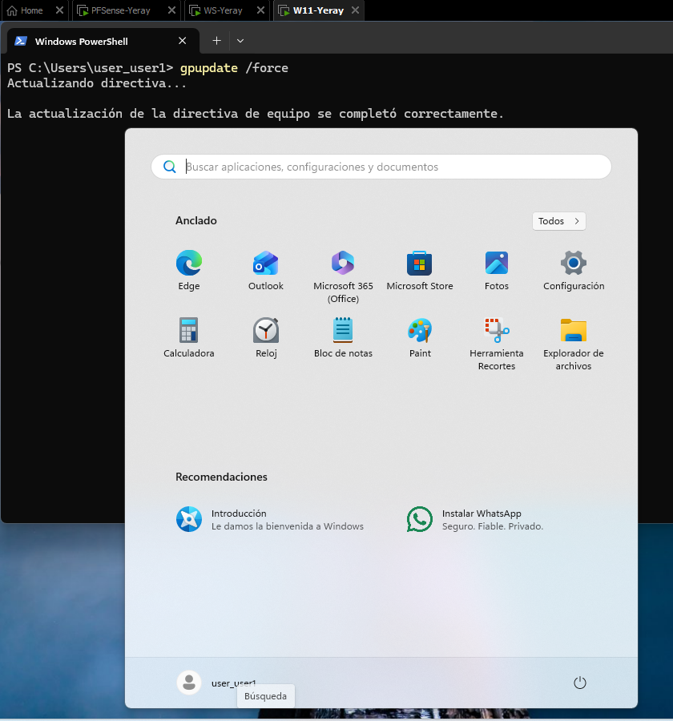

---

### Verificación en el Programador de tareas:
Tras abrir el **Programador de tareas** como administrador, buscar la tarea creada mediante GPO aparece correctamente en la biblioteca del cliente.

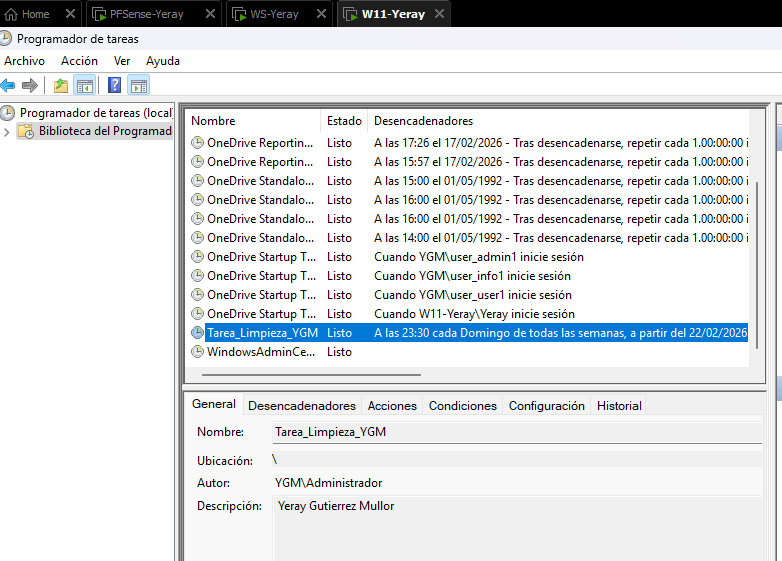

---

### Ejecución manual de la tarea:
Realizar una ejecución manual de la tarea mediante la opción **Ejecutar** para validar el correcto funcionamiento del script en el equipo cliente.

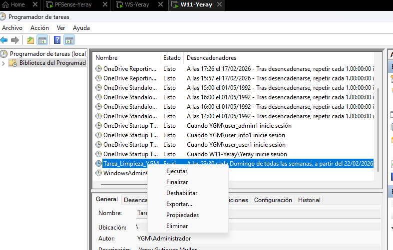

---

### Muestra del LOG creado:
Verificar la creación del archivo de registro en `C:\Logs`, confirmando que el script se ha ejecutado con éxito y ha realizado las tareas de limpieza.

